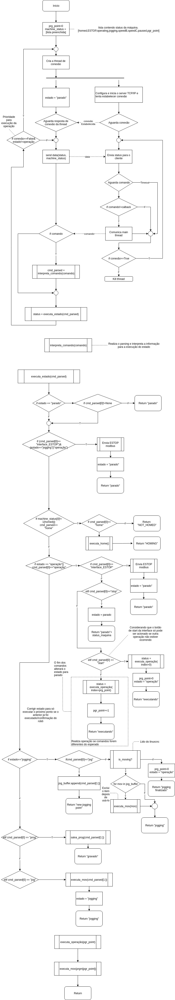

## Server que será implementado na BBB

Processo da implementação:
1. Server TCP: Check;
2. Paralelismo: Check;
3. (~~Callbeck~~) Callback: 80%;
4. Interpretação do que é recebido: Doing;
5. Salvar programa: Calm down, folks;
6. Sequência de execução do Main: Too easy, ask me another one;
7. ModBus: Testado separado;
8. Função executa_estado: Nope
9. Arquivos hall: Nope
10. Integração do fluxo com hall: Nope

### Fluxograma

